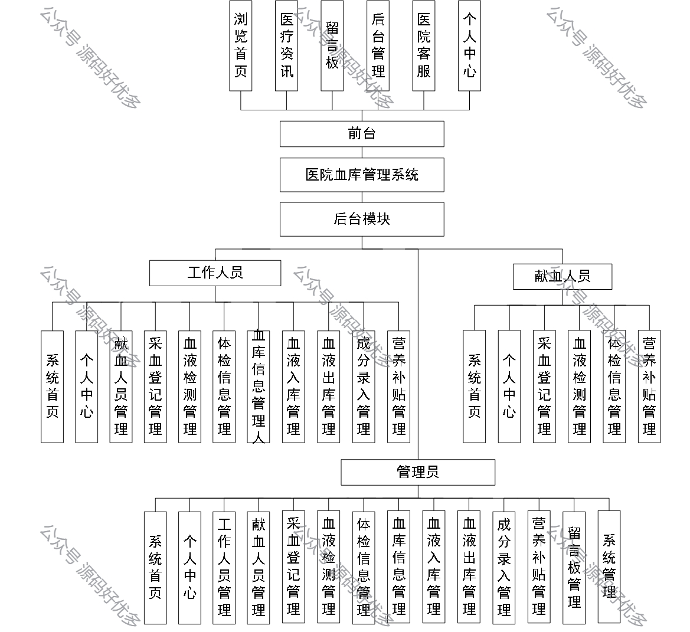
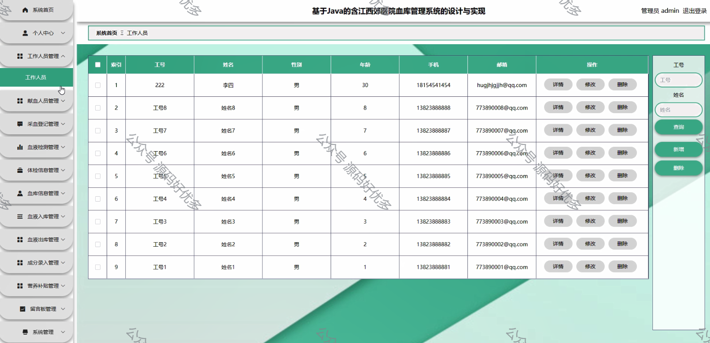
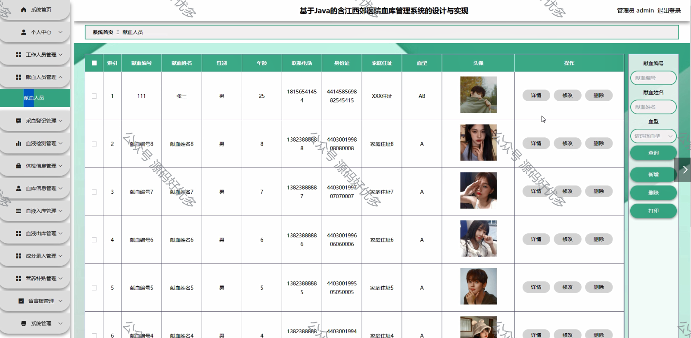
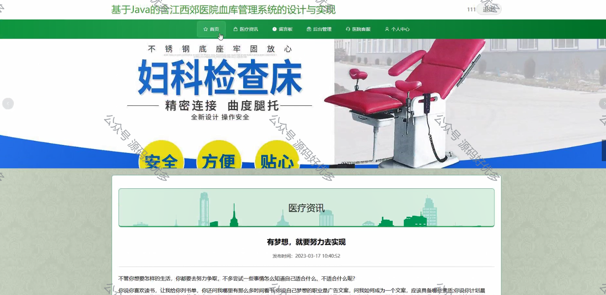
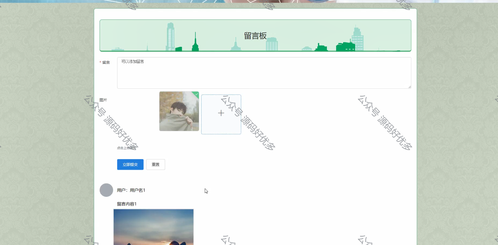
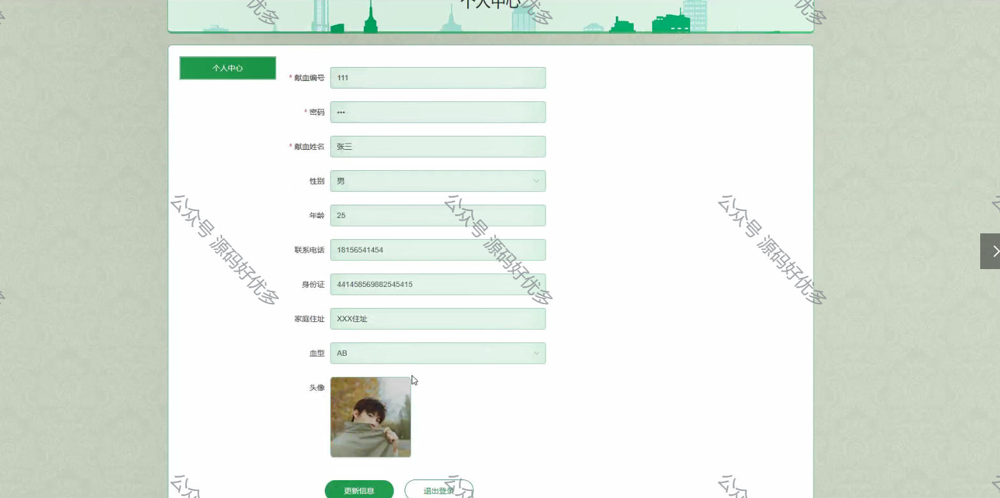
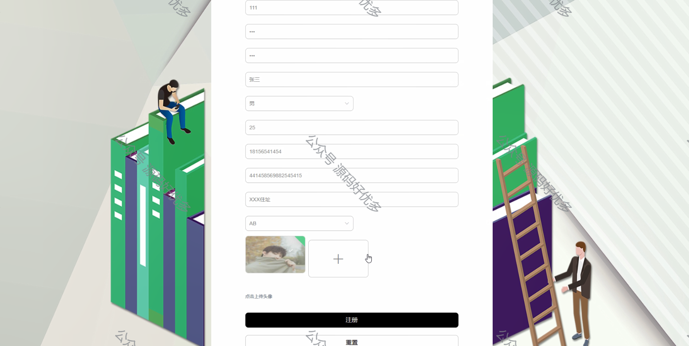
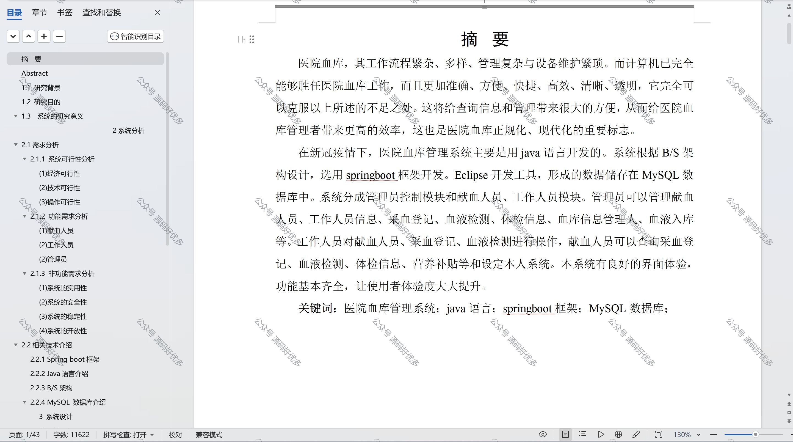

 
## 查看主页获取源码

> **作者介绍**： **✌**全网粉丝10W+本平台特邀作者、博客专家、CSDN新星计划导师、java领域优质创作者,博客之星、掘金/华为云/阿里云/InfoQ等平台优质作者、专注于项目实战 **✌**

  

### 一、作品包含

源码+数据库+设计文档万字+PPT+全套环境和工具资源+部署教程

### 二、项目技术

前端技术：Html、Css、Js、Vue、Element-ui

数据库：MySQL

后端技术：Java、Spring Boot、MyBatis

  

### 三、运行环境

开发工具：IDEA/eclipse

数据库：MySQL5.7

数据库管理工具：Navicat10以上版本

环境配置软件： JDK1.8+Maven3.6.3

前端Nodejs：14

### 四、项目介绍
项目编号：springbootA116

江西郊医院血库管理系统是在医院对血液资源管理要求日益提高，以及信息技术在医疗领域应用日益广泛的背景下，应运而生的一套专门用于血库管理的信息化系统。旨在帮助血库工作人员提高工作效率，确保血液资源的合理利用和安全性，提升医疗服务质量，同时推动医院血库管理的现代化和智能化。

前台用户功能：浏览首页、医疗资讯、留言板、后台管理、医院客服、个人中心。

后台分为管理员、工作人员、献血人员。
管理员的功能：系统首页、个人中心、工作人员管理、献血人员管理、采血登记管理、血液检测管理、体检信息管理、血库信息管理、血液入库管理、血液出库管理、成分录入管理、营养补贴管理、留言板管理和系统管理。
工作人员的功能：系统首页、个人中心、献血人员管理、采血登记管理、血液检测管理、体检信息管理、血库信息管理人、血液入库管理、血液出库管理、成分录入管理以及营养补贴管理。
献血人员的功能：系统首页、个人中心、采血登记管理、血液检测管理、体检信息管理、营养补贴管理。
### 五、运行截图

  
